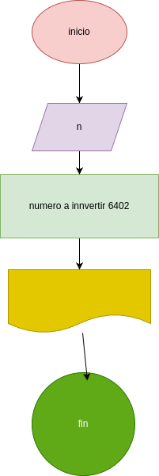

# programa 3 para invertir_numero
programa en python para invertir un numero 

## Analisis

### verables de entrada
- n: numero de 4 dijitos

### procesamiento
- r4= ultimo dijito
- r3= tercer dijito
- r2= segundo dijito
- r1= primer dijito
- ni= el numero invertido

r4= n%10
r3=(n//10)%10
r2=(n//100)%10
r1=(n//1000)%10

ni= r4*1000+r3*100+r2*10+r1

## diseño

## construccion
- codigo implementado en repositorio_para_invertir_un_numero
